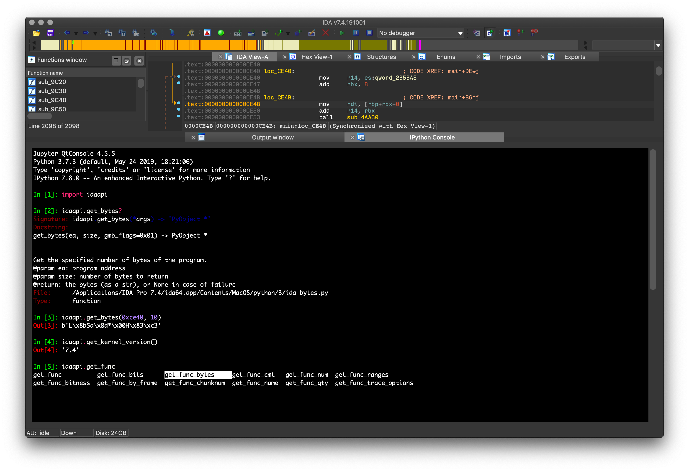

= IPyIDA

IPyIDA is a python-only solution to add an IPython console to IDA Pro. Use
`<Shift-.>` to open a window with an embedded _Qt console_. You can then
benefit from IPython's autocompletion, online help, monospaced font input
field, graphs, and so on.

You can also connect to the kernel outside of IDA using `ipython console
--existing`.

== Install

IPyIDA has been tested with IDA 6.6 and up on Windows, OS X and Linux, up to
7.6.

=== Fast and easy install

A script is provided to install IPyIDA and its dependencies automagically from
the IDA console. Simply copy the following line to the IDA console.

.Python 2
[source,python]
----
import urllib2; exec urllib2.urlopen('https://github.com/eset/ipyida/raw/stable/install_from_ida.py').read()
----

.Python 3
[source,python]
----
import urllib.request; exec(urllib.request.urlopen('https://github.com/eset/ipyida/raw/stable/install_from_ida.py').read())
----

On macOS, `Python3.framework` does not provide a trusted CA file. You can use
the system-wide file `/etc/ssl/cert.pem`.

[source,python]
----
import urllib.request; exec(urllib.request.urlopen('https://github.com/eset/ipyida/raw/stable/install_from_ida.py', cafile="/etc/ssl/cert.pem").read())
----

The script will do the following:

1. Install `pip` if it's not already installed
2. Install the `ipyida` package from https://pypi.org/project/ipyida/[PyPi]
3. Copy `ipyida_plugin_stub.py` to the user's `plugins` directory
4. Load the IPyIDA plugin

You can inspect the link:install_from_ida.py[] script if you wish to see
exactly what it does.

==== Upgrading

Rerun the install script to update to the latest version and restart IDA.

=== Install it the IDA way

If you'd rather manage the dependencies and updates yourself, you can
copy `ipyida_plugin_stub.py` and the `ipyida` directory inside IDA's
`plugins` directory.

This method requires that you manage dependencies on your own. IPyIDA requires
the `ipykernel` and `qtconsole` package, and the `qasync` package if using
`ipykernel` version 5 or newer.

== Jupyter Notebook integration

IPyIDA includes a magic command, `%open_notebook`, to open a browser with a
notebook attached to IPyIDA. The command takes care of installing dependencies
on its first run and starting a Notebook server unless one is already running.
Check the command help (by typing `%open_notebook?`) for further options.

== Customizing the IPython console

By default, the console does not have any globals available. If you want to
have module imported before the console is opened, IPyIDA will read the
`ipyidarc.py` file from the IDA user directory (`idaapi.get_user_idadir()`).
Anything you import in this file will be available in the IPython console.

This is similar to the `idapythonrc.py` file.

=== Dark mode

With a dark theme in IDA Pro, it's more convenient to also have a dark theme in
the IPython console. To activate the dark theme built into `qtconsole`, add the
following in your `ipyidarc.py`:

[source, python]
----
import qtconsole.styles
import ipyida.ida_qtconsole
ipyida.ida_qtconsole.set_widget_options(dict(
    style_sheet = qtconsole.styles.default_dark_style_sheet,
    syntax_style = qtconsole.styles.default_dark_syntax_style
))
----

== Caveats

=== External console not responding if IDA's window is in the background for too long

This problem is specific to OS X's App Nap feature in OS X 10.9 and up. When
running  Disabling App Nap for IDA Pro seems to fix the problem, but is a a hack
for now and will use more battery on a laptop, we should find a better solution.

Here is how to disable App Nap for IDA Pro:

[source,bash]
----
defaults write com.hexrays.idaq   NSAppSleepDisabled -bool YES
defaults write com.hexrays.idaq64 NSAppSleepDisabled -bool YES
----

== Similar work

@james91b also successfully integrated a IPython kernel in IDA. Being a
non-Windows IDA user, I needed something cross-platform and took a Python-only
approach to implement it. Although the some of the implementation idea comes
from that project, IPyIDA was written from scratch. Hat tip to @james91b and all
IDA_IPython contributors. IDA_IPython is available on Github at
https://github.com/james91b/ida_ipython.
