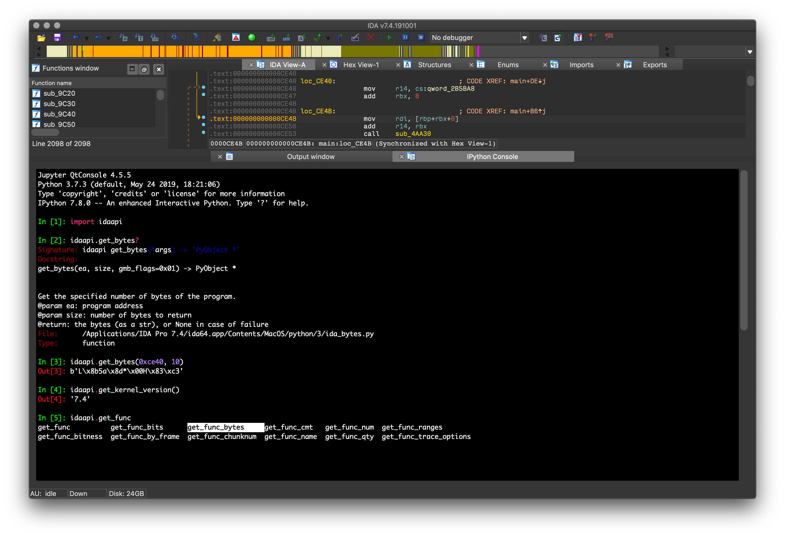
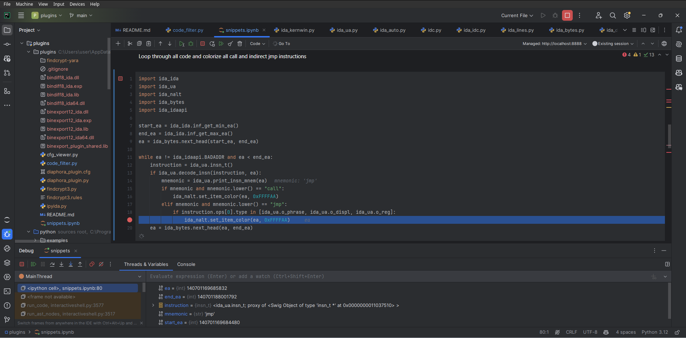

= IPyIDA

IPyIDA is a python-only solution to add an IPython console to IDA Pro. Use
`<Shift-.>` to open a window with an embedded _Qt console_. You can then
benefit from IPython's autocompletion, online help, monospaced font input
field, graphs, and so on.

You can also connect to the kernel outside of IDA using `ipython console
--existing`.

== Install

IPyIDA should be compatible with IDA 6.6 and later on Windows, OS X and Linux.
It has been tested on IDA up to 9.2.

=== Install with hcli

IPyIDA ships an `ida-plugin.json` manifest and can be installed with
https://hcli.docs.hex-rays.com/[hcli], Hex-Rays' command-line plugin manager.

[source,bash]
----
hcli plugin install ipyida
----

==== Installing from source (editable)

To hack on IPyIDA itself, clone the repository and install it in editable
mode. hcli will symlink the repository into IDA's plugins directory and
install its Python dependencies, so local edits take effect on the next
plugin reload.

[source,bash]
----
git clone https://github.com/eset/ipyida.git
hcli plugin install -e ipyida
----

==== Upgrading

[source,bash]
----
hcli plugin upgrade ipyida
----

== Jupyter Notebook integration

IPyIDA includes a magic command, `%open_notebook`, to open a browser with a
notebook attached to IPyIDA. The command takes care of installing dependencies
on its first run and starting a Notebook server unless one is already running.
Check the command help (by typing `%open_notebook?`) for further options.

== Customizing the IPython console

By default, the console does not have any globals available. If you want to
have module imported before the console is opened, IPyIDA will read the
`ipyidarc.py` file from the IDA user directory (`idaapi.get_user_idadir()`).
Anything you import in this file will be available in the IPython console.

This is similar to the `idapythonrc.py` file.

=== Dark mode

IPyIDA automatically matches IDA's current theme: it inspects IDA's Qt
palette when the console is created and switches to `qtconsole`'s built-in
dark style if IDA is running a dark theme.

If you want to force a specific style regardless of IDA's theme, you can
still override it in your `ipyidarc.py`:

[source, python]
----
import qtconsole.styles
import ipyida.ida_qtconsole
ipyida.ida_qtconsole.set_widget_options(dict(
    style_sheet = qtconsole.styles.default_dark_style_sheet,
    syntax_style = qtconsole.styles.default_dark_syntax_style
))
----

== IDE Integration

One of the noteworthy features of iPyIDA is the ability to integrate it with
the PyCharm IDE. This allows features such as stepping through code,
syntax highlighting, Github CoPilot integration, etc. To make use of this
feature, simply launch IDA and open a database, create a Jupyter Notebook
in PyCharm, add some code, and click run. IPyIDA does all the magic in the
background.

== Caveats

=== External console not responding if IDA's window is in the background for too long

This problem is specific to OS X's App Nap feature in OS X 10.9 and up. When
running  Disabling App Nap for IDA Pro seems to fix the problem, but is a a hack
for now and will use more battery on a laptop, we should find a better solution.

Here is how to disable App Nap for IDA Pro:

[source,bash]
----
defaults write com.hexrays.idaq   NSAppSleepDisabled -bool YES
defaults write com.hexrays.idaq64 NSAppSleepDisabled -bool YES
----

== Similar work

@james91b also successfully integrated a IPython kernel in IDA. Being a
non-Windows IDA user, I needed something cross-platform and took a Python-only
approach to implement it. Although the some of the implementation idea comes
from that project, IPyIDA was written from scratch. Hat tip to @james91b and all
IDA_IPython contributors. IDA_IPython is available on Github at
https://github.com/james91b/ida_ipython.
